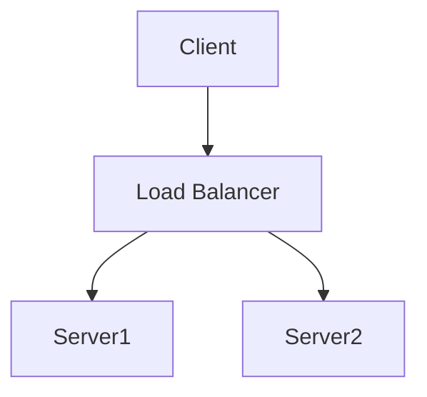

# MarkdownRenderer Component

A powerful React component for rendering markdown with advanced features.

## Features

- ✅ Standard markdown syntax
- 🏆 GitHub Flavored Markdown (tables, strikethrough, task lists)
- 🎨 Syntax highlighting for code blocks
- 📊 Math equations with KaTeX
- 📈 Mermaid diagrams
- 📑 Table of contents generation
- 🖥️ HTML support
- 📝 Footnotes
- 🔗 Auto-linked headers with custom IDs

## Installation

To use this component in your React project, you need to install the required dependencies:

```bash
npm install react-markdown remark-gfm remark-math rehype-katex rehype-raw remark-directive rehype-slug remark-toc react-syntax-highlighter mermaid
```

## Usage

### Basic Usage

```jsx
import MarkdownRenderer from './path/to/MarkdownRenderer';

function MyComponent() {
  const markdown = `
  # Hello World
  
  This is a simple markdown example.
  
  * List item 1
  * List item 2
  
  \`\`\`javascript
  console.log('Hello, world!');
  \`\`\`
  `;

  return (
    <div>
      <h1>My Markdown Content</h1>
      <MarkdownRenderer markdown={markdown} />
    </div>
  );
}
```

### Props

The `MarkdownRenderer` component accepts the following props:

| Prop | Type | Default | Description |
|------|------|---------|-------------|
| `markdown` | string | Required | The markdown content to render |
| `className` | string | `''` | CSS class to apply to the container div |
| `tocHeading` | string | `'Table of Contents'` | The heading text used for the table of contents |
| `syntaxHighlighterTheme` | object | `vscDarkPlus` | The theme for code syntax highlighting |
| `allowHtml` | boolean | `true` | Whether to allow HTML in the markdown |

### Using with Custom Styles

```jsx
import MarkdownRenderer from './path/to/MarkdownRenderer';
import { docco } from 'react-syntax-highlighter/dist/esm/styles/hljs';
import './custom-markdown.css';

function StyledMarkdownComponent() {
  return (
    <MarkdownRenderer 
      markdown={myMarkdown} 
      className="custom-markdown-container"
      syntaxHighlighterTheme={docco}
      tocHeading="Contents"
      allowHtml={false}
    />
  );
}
```

## Special Features

### Table of Contents

Add a table of contents by including a section with the heading "Table of Contents":

```markdown
# My Document

## Table of Contents

## First Section
Content here...

## Second Section
More content...
```

### Math Equations

Use KaTeX syntax for math equations:

```markdown
Inline math: $E = mc^2$

Block math:
$$
\frac{1}{\sqrt{2\pi\sigma^2}} e^{-\frac{(x-\mu)^2}{2\sigma^2}}
$$
```

### Mermaid Diagrams

Create diagrams using Mermaid syntax:

```markdown

```

### Custom Header IDs

Add custom IDs to headers for direct linking:

```markdown
### My Section {#custom-id}
```

## License

MIT 