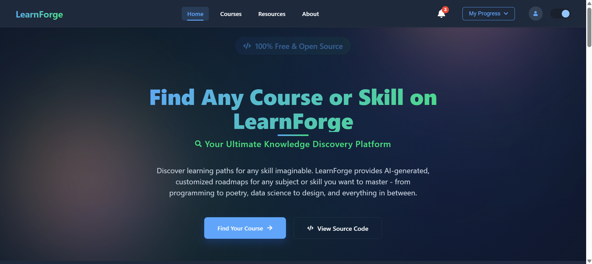
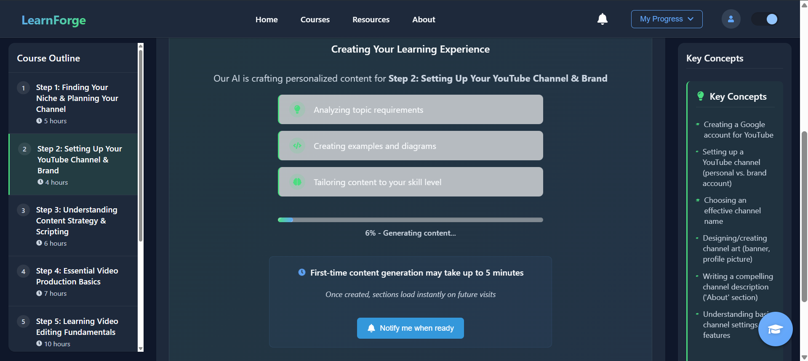
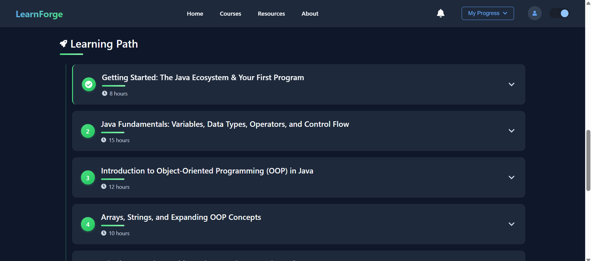
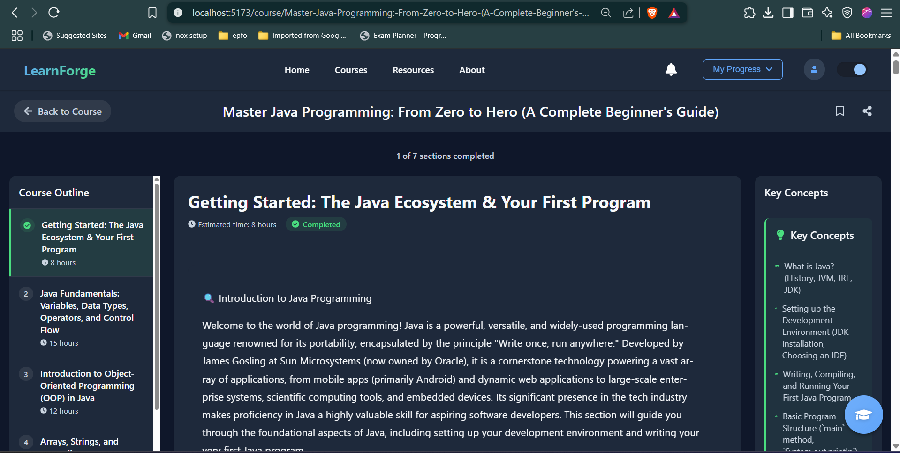
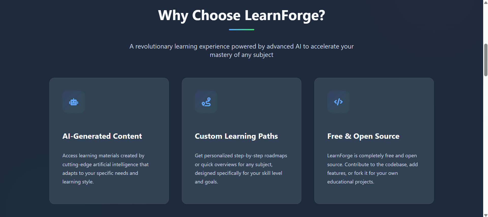
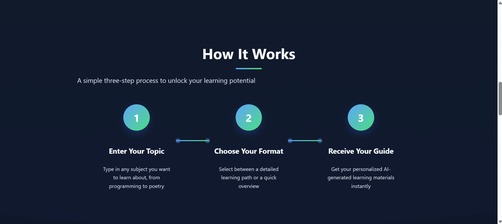
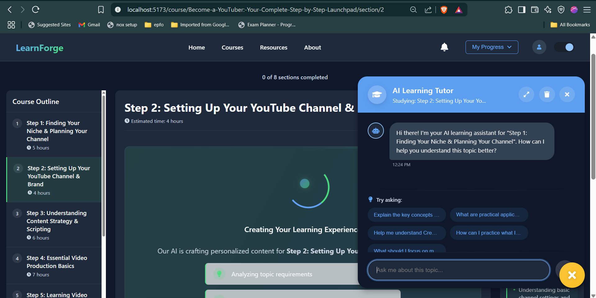
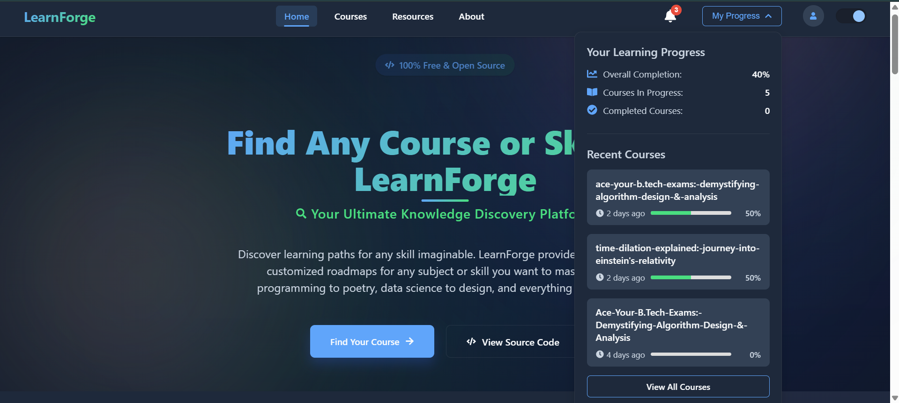
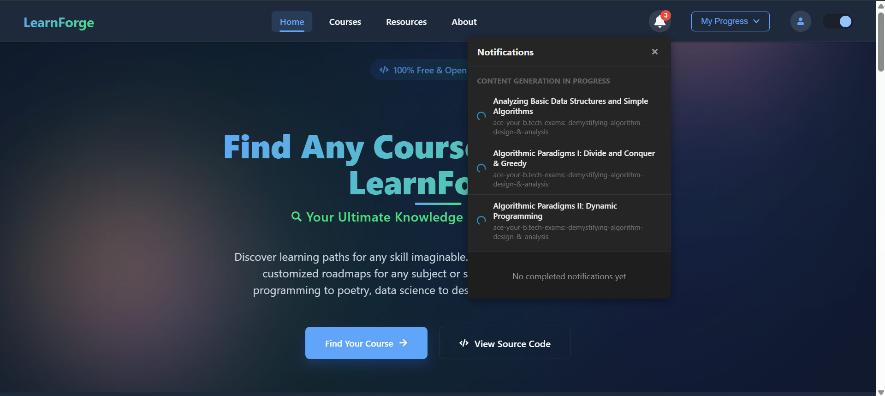
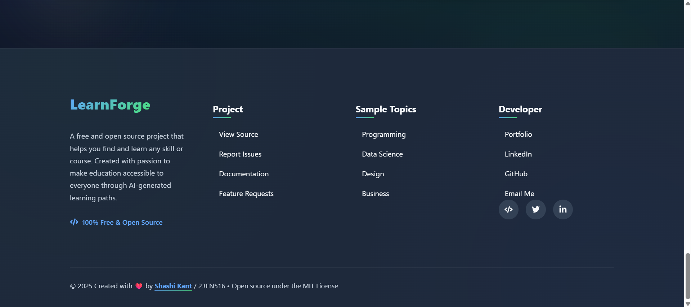

# LearnForge

**LearnForge** is an open‑source, AI‑powered learning platform that dynamically generates personalized learning paths and course content for any topic or skill. It combines a Node.js/Express backend with a React frontend to deliver rich, interactive coursework, track user progress, and provide an AI chat assistant for real‑time help.

> ⚠️ **Note:** This project is currently in development.

## 🎬 Demo

[](https://youtu.be/DKCuWwpS5XA)

The video above demonstrates LearnForge in action, including:
- Course generation with AI
- Interactive learning paths
- Progress tracking
- AI chat assistant

## 📸 Screenshots

<details>
<summary>Click to expand screenshots</summary>

### Home Page & Course Generation

*The LearnForge homepage where users can generate new courses on any topic*


*AI-driven course and content generation*

### Course Details View

*Overview of course structure with learning path and estimated completion times*


*Detailed course introduction with key learning objectives and requirements*

### Learning Experience

*Interactive learning environment with AI-generated content and progress tracking*


*Enhanced learning experience with interactive components and detailed content*


*Intuitive navigation through course sections with progress indicators*

### AI Chat Assistant

*Context-aware AI assistant helps answer questions about the current topic*

### Progress Tracking & Bookmarks

*Save and organize your favorite courses for quick access*

### Notifications

*Stay updated with course completion notifications and alerts*

### Additional Features

*Comprehensive site navigation and information in the footer section*

</details>

---

## 🚀 Key Features

- **AI‑Generated Learning Paths**  
  Dynamically generate a structured sequence of topics for any subject.
- **Topic‑Level Content Generation**  
  Produce detailed explanations, examples, and exercises per topic via AI.
- **Chat Assistant**  
  Context‑aware AI chat for answering questions and clarifications as you learn.
- **Progress Tracking & Bookmarking**  
  Mark sections complete, view overall progress, and save favorite courses for later.
- **Duplicate‑Request Prevention**  
  Built‑in debouncing to avoid redundant AI calls and reduce costs.
- **API Key Rotation & Retry Logic**  
  Support for up to 10 Gemini API keys with automatic rotation to prevent rate limits.
- **Responsive UI**  
  Mobile‑friendly React interface with light/dark mode support and markdown‑rendered content.

---

## 📦 Tech Stack

- **Backend**: Node.js, Express, Mongoose (MongoDB)  
- **Frontend**: React, React Router, Context API, Markdown‑to‑JSX  
- **AI Integration**: Google Gemini API (primary), OpenAI config available but not currently implemented
- **Persistence**: MongoDB Atlas (or self‑hosted)  
- **Styling**: CSS Modules

---

## 📁 Project Structure

```
LearnForge/
├── Backend/
│   ├── config/
│   │   └── apiConfig.js        # AI provider keys & endpoints
│   ├── models/
│   │   └── CourseSchema.js     # Mongoose schemas
│   ├── routes/
│   │   └── courseRoutes.js     # /generate, /benefits, /topic, /chat, etc.
│   ├── services/
│   │   └── aiService.js        # Core AI request logic & retry/key‑rotation
│   └── utils/
│       └── userAgentRotator.js # User-Agent randomizer
├── Frontend/
│   ├── public/                 # Static assets & index.html
│   └── src/
│       ├── App.jsx             # Entry point & router
│       ├── components/
│       │   ├── AIChatAssistant/# Chat UI & context integration
│       │   ├── CourseProgressSummary/
│       │   ├── MarkdownRender/ # Renders AI‑generated MD
│       │   └── Notifications/
│       ├── Pages/
│       │   ├── Home/
│       │   ├── Courses/
│       │   ├── CourseDetails/
│       │   └── LearningPage/
│       └── utils/
│           └── CourseProgressManager.js # LocalStorage progress logic
├── media/
│   └── screenshots/            # Application screenshots
└── README.md
```

---

## 🔧 Installation

1. **Clone the repo**  
   ```bash
   git clone https://github.com/ShashiKantDTU/LearnForge.git
   cd LearnForge
   ```

2. **Backend setup**

   ```bash
   cd Backend
   npm install
   cp .env.example .env
   # Configure at least one GEMINI_API_KEY (up to 10 supported)
   # MONGODB_URI and other environment variables
   npm start
   ```
   Backend server runs on `http://localhost:3000` by default.

3. **Frontend setup**

   ```bash
   cd ../Frontend
   npm install
   npm start
   ```

   The React app runs on `http://localhost:5000` by default.

### API Key Configuration

- At minimum, one Gemini API key is required
- The system supports configuring up to 10 Gemini API keys for rotation to prevent rate limits
- OpenAI configuration is available in the codebase but not currently implemented

---

## 📝 Usage

1. **Generate a course**
   On the homepage, select a field and level or enter a custom topic to create a new AI‑driven learning path.
2. **Explore course details**
   Click on any course to view its sections. The content is rendered in markdown, with examples, diagrams, and exercises.
3. **Track your progress**
   Mark each section complete. View your overall progress on the Course Progress page.
4. **Chat with AI**
   Open the chat widget anytime to ask questions about the current section or get further explanations.
5. **Bookmark & revisit**
   Save courses to your bookmarks list for quick access later.

---

## 🤝 Contributing

1. Fork the repository
2. Create a feature branch (`git checkout -b feature/YourFeature`)
3. Commit your changes (`git commit -m 'Add some feature'`)
4. Push to the branch (`git push origin feature/YourFeature`)
5. Open a Pull Request


---

## 📄 License

This project is licensed under the [MIT License](LICENSE).
Feel free to use, modify, and distribute it!

---

## 🙏 Acknowledgments

* Inspiration from [GitHub's README guidelines](https://docs.github.com/articles/about-readmes)
* README template ideas from [jehna/readme-best-practices](https://github.com/jehna/readme-best-practices)
